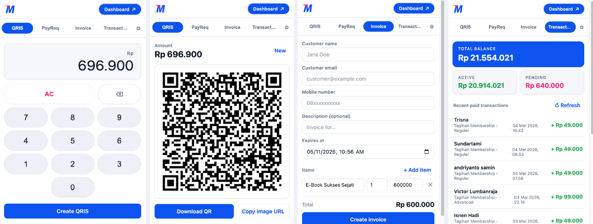

# Mayar Quick Tools

A Chrome extension that lets Mayar merchants create dynamic QRIS codes,
single payment requests, and invoices — and check balance + recent paid
transactions — without leaving the current tab.



## Features

- **QRIS** — Calculator-style amount entry. Tap **Create QRIS** to
  generate a dynamic QR through `POST /qrcode/create`, then download the
  image or copy its URL.
- **PayReq** — Customer name, email, mobile, amount, optional
  description. Sends a single payment request via `POST /payment/create`
  with a 14-day expiry. Copy or open the returned link.
- **Invoice** — Customer details, optional description, datetime expiry,
  and one or more line items (description / quantity / rate). Live total.
  Calls `POST /invoice/create` and returns a copy/open-able invoice link.
- **Transactions** — Reads `GET /balance` and `GET /transactions` to
  show total / active / pending balance plus a paginated list of recent
  paid transactions, with refresh and load-more.

A primary-colored **Dashboard ↗** button in the brand bar opens
[web.mayar.id](https://web.mayar.id/) in a new tab.

## Install (unpacked)

1. Clone or download this repo.
2. Visit `chrome://extensions` and enable **Developer mode**.
3. Click **Load unpacked** and select the project folder.
4. Open the extension popup, click the **⚙** icon (or open the
   extension's Options) and paste your Mayar API key.

The key is stored in `chrome.storage.sync` and used only to call Mayar's
API directly from your browser.

## Settings

- **API key** — required.
- **Default redirect URL** — where customers go after paying a payment
  request or invoice. Defaults to `https://mayar.id/`.
- **Theme** — Light (default), Dark, Neon, Matrix, Tokyo Night, or
  System (matches OS).

## API endpoints used

| Tab          | Method | Path                |
|--------------|--------|---------------------|
| QRIS         | POST   | `/hl/v1/qrcode/create` |
| PayReq       | POST   | `/hl/v1/payment/create` |
| Invoice      | POST   | `/hl/v1/invoice/create` |
| Transactions | GET    | `/hl/v1/balance` |
| Transactions | GET    | `/hl/v1/transactions?page=&pageSize=` |

Base URL: `https://api.mayar.id`. All calls authenticate with
`Authorization: Bearer <YOUR_API_KEY>`.

See the official Mayar API docs at
[docs.mayar.id](https://docs.mayar.id/) for the full reference.

## Project layout

```
manifest.json          # MV3 manifest
popup/                 # popup UI (HTML / CSS / JS)
options/               # settings page
lib/api.js             # Mayar API client
lib/theme.js           # theme loader (light / dark / neon / matrix / tokyo / system)
icons/                 # toolbar icons + brand-bar logo
assets/                # screenshots
```

No build step — vanilla JS modules. Reload the extension in
`chrome://extensions` after editing.

## License

Released under the [MIT License](LICENSE).